# 🚀 Three-Tier AWS ECS Fargate Infrastructure

[](https://github.com/thejondaw/three-tier-aws-ecs-fargate/actions)
[](https://opensource.org/licenses/MIT)
[](https://www.terraform.io)
[](https://aws.amazon.com/fargate/)

> Production-grade Three-Tier infrastructure deployment on AWS ECS Fargate using Terraform IaC

## 🏗️ Architecture Overview

This project implements a secure, scalable three-tier architecture on AWS using modern containerized approach:

```mermaid
graph TD
    Client[🌐 Client] --> ALB[📡 Application Load Balancer]
    subgraph "VPC"
        subgraph "Public Subnets"
            ALB --> WEB[🖥️ WEB Tier - Port 80]
        end
        subgraph "Private Subnets"
            WEB --> API[⚡ API Tier - Port 3000]
            API --> DB[💾 Aurora PostgreSQL - Port 5432]
        end
    end
```



## 🎯 Key Features

- **Infrastructure as Code (IaC)**: 100% Terraform-managed infrastructure
- **Containerization**: ECS Fargate for serverless container orchestration
- **Database**: Aurora PostgreSQL 15.3 Serverless v2 for automatic scaling
- **Security**: Private subnets, security groups, and IAM roles
- **CI/CD**: GitHub Actions workflow for automated deployments
- **Monitoring**: CloudWatch integration for logs and metrics

## 🛠️ Tech Stack

- **AWS Services**: ECS, Fargate, Aurora, VPC, ALB
- **Infrastructure**: Terraform
- **Applications**: 
  - Backend API: Node.js
  - Frontend: Web application
  - Database: Aurora PostgreSQL 15.3
- **CI/CD**: GitHub Actions
- **Containerization**: Docker

## 🚀 Quick Start

### Prerequisites

- AWS CLI configured with appropriate credentials
- Terraform ≥ 1.0
- Docker installed
- Make (optional, for using Makefile)

### Deployment

1. Clone the repository:
```bash
git clone https://github.com/thejondaw/three-tier-aws-ecs-fargate.git
cd three-tier-aws-ecs-fargate
```

2. Initialize Terraform:
```bash
terraform init
```

3. Build and push Docker images:
```bash
# API Container
docker buildx build --platform linux/amd64 -t jondaw/app-api:latest ./api
docker push jondaw/app-api:latest

# Web Container
docker buildx build --platform linux/amd64 -t jondaw/app-web:latest ./web
docker push jondaw/app-web:latest
```

4. Deploy infrastructure:
```bash
terraform plan
terraform apply
```

## 📦 Container Management

### Building Images

```bash
# Clean up Docker system
make docker-cleanup

# Build and push API container
make build-api

# Build and push Web container
make build-web
```

## 🔐 Security Considerations

- Private subnets for API and Database tiers
- Security groups with minimal required access
- IAM roles following principle of least privilege
- Encrypted data at rest using AWS KMS
- TLS termination at ALB

## 📈 Scaling & Performance

- Auto-scaling configured for both API and Web tiers
- Aurora Serverless v2 automatic scaling
- Load balancer health checks
- CloudWatch alarms for resource utilization

## 🤝 Contributing

1. Fork the repository
2. Create your feature branch (`git checkout -b feature/amazing-feature`)
3. Commit your changes (`git commit -m 'feat: Add amazing feature'`)
4. Push to the branch (`git push origin feature/amazing-feature`)
5. Open a Pull Request

## 📄 License

This project is licensed under the MIT License - see the [LICENSE](LICENSE) file for details

## 🙏 Acknowledgments

- AWS ECS Best Practices
- Terraform AWS Provider Documentation
- Node.js Production Best Practices

---
⚡️ Maintained with 💻 by [JonDaw](https://github.com/thejondaw)
